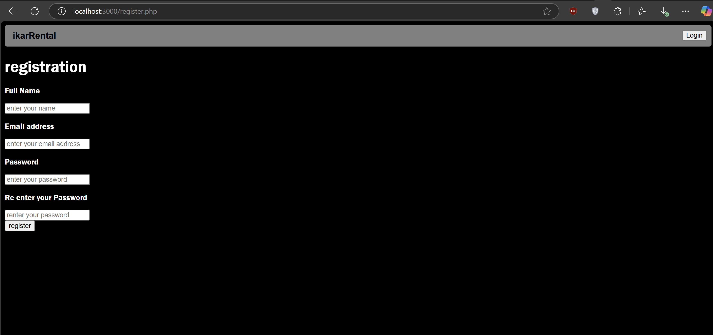
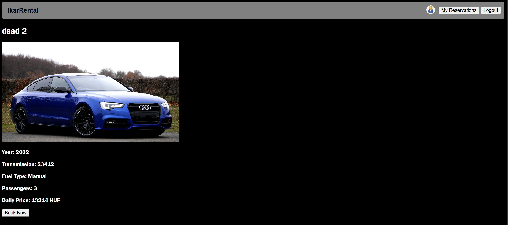
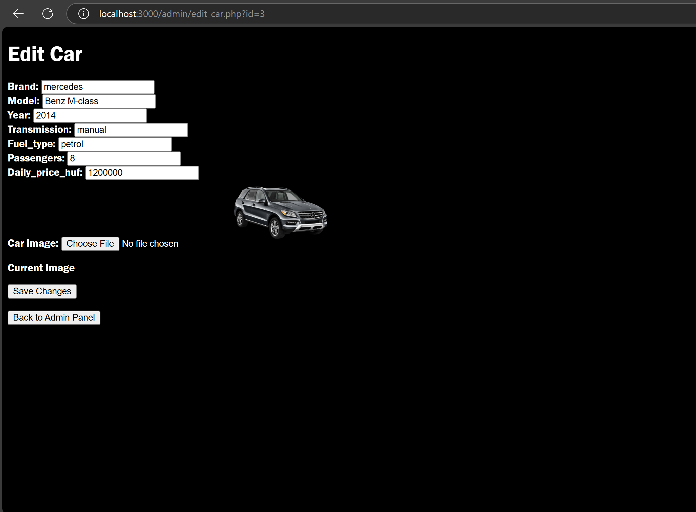
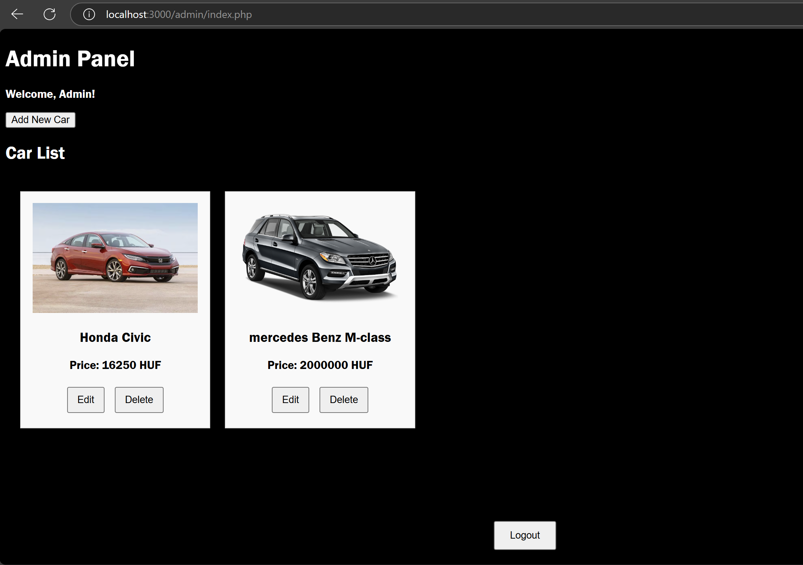

# Car Booking Website

## Description

This PHP-based web application allows users to browse and book rental cars. It uses JSON files for data storage instead of a traditional database. Users can register, log in, and book cars for specific time periods. Administrators have the ability to manage car listings and view all bookings.

## Features

### Guest Users
- Browse available cars without logging in.
- View car details including images, brand, type, passenger capacity, transmission type, and daily price.
- Apply filters to search for cars based on:
  - Availability within a specific time range.
  - Transmission type (Automatic/Manual).
  - Passenger capacity.
  - Daily rental price.

### Registered Users
- Register and log in to book cars.
- Book a car for a specified time period.
- View their own past bookings (feature in development).
- Log out securely.

### Administrator Functions
- Log in with a dedicated admin account.
- Add new cars to the listing.
- Edit existing car details.
- Delete cars (removing related bookings as well).
- View all bookings made by users.

## Technology Stack
- **Backend**: PHP (without frameworks)
- **Frontend**: HTML, CSS (custom styles and optional CSS frameworks)
- **Data Storage**: JSON files

## Installation & Setup
1. Ensure you have a local server running (e.g., XAMPP, WAMP, or built-in PHP server).
2. Clone or download the project files.
3. Place the project folder in your server’s document root (e.g., `htdocs` for XAMPP).
4. Start the server and navigate to `http://localhost/car-booking/`.

## Usage Guide

### Register & Login
1. Navigate to the registration page.

2. Provide full name, email, and password.

3. Log in with your registered credentials.

### Booking a Car
1. Browse available cars on the homepage.

2. Select a car to view its details.

3. If logged in, proceed with booking by selecting a time period.

4. A confirmation page will indicate success or failure (if the car is already booked for that time).

  Or it could fail if car is already booked for that time

### Admin Panel
1. Log in using the default admin credentials (`admin@ikarrental.hu`, `admin`).

2. Manage car listings (add/edit/remove cars).

## Future Enhancements
- Implement user booking history on their profile page.
- Improve UI responsiveness and design.
- Add email notifications for bookings.
- implement all booking history to be available for admin.

## Screenshots
### using filters to choose from cars
1. set the price range.

2. press the filter button.

### Admin Panel: Adding a Car
1. After Logging in using the default admin credentials (`admin@ikarrental.hu`, `admin`).

2. press add new car buttton.

3. enter the new car details and import the cars image.

4. choose Car image.

5. Press Add car to save changes.

 

### Admin Panel: Editing a Car
1. Choose a car and press edit.

2. Make Changes(Ex: price).

3. Press save and Car details are updated.

### Admin Panel: Deleting a Car
- Choose a car and press delete button.

- All changes are visible in user panel(HomePage).

## License
This project is for educational purposes and does not include a license for commercial use.

## Author
Your Name

